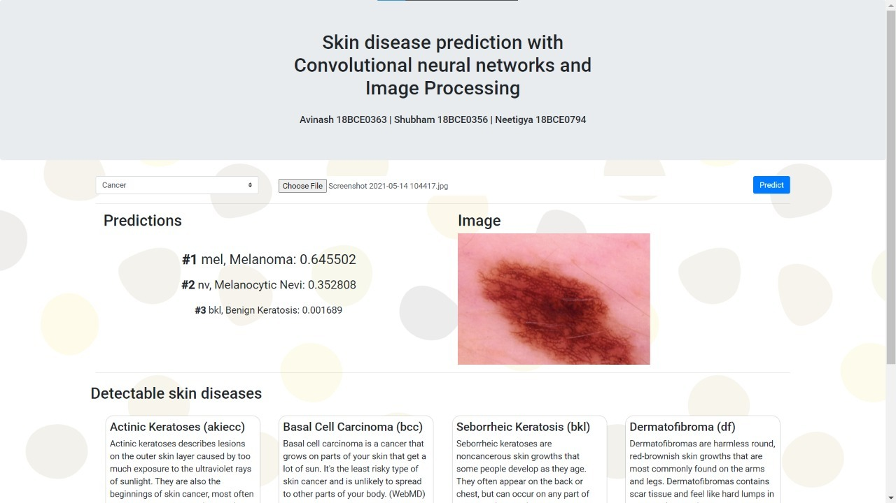

# Skin disease Prediction using Convolutional neural networks 

An Image processing project by 
Avinash 18BCE0363
Shubham 18BCE0356
Neetigya 18BCE0794

With ever growing pollution and climate disruptions, our way of living and lifestyle is giving rise to many skin related diseases. For some of which early and accurate detection becomes utmost necessary in order to save the patient. Given the availability of skin doctors in hospitals and huge expenditure associated with appointments, it becomes almost impossible for a poor to afford even a diagnosis related to a skin disease. The project aims at providing skin disease prediction technology made using deep learning. The project aims to preprocess the images, perform data augmentation and finally make use of deep learning technology to train itself with the various skin images. Then it is tested with the test set to check for accuracy. Finally a web implementation is developed to deploy our model.

## Demo

## video
https://drive.google.com/file/d/1h3l7puX44rmxC8BYw-G3uDy_uWltWEdT/view?usp=sharing